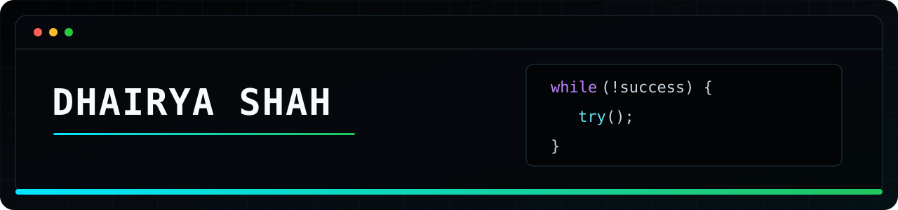

<div align="center">



<br />

<a href="https://www.linkedin.com/in/shahdhairya245/"></a>
<a href="https://youtu.be/rFE32i1E8xM"></a>

</div>

## `01 // PROFILE`

I build practical software at the intersection of **AI, automation, and the web**. I like taking repetitive, messy workflows and turning them into focused tools that are simple to use and useful in the real world.

```text
CURRENT FOCUS  →  AI-assisted automation
BUILDING       →  data extraction + backend workflows
APPROACH       →  prototype fast, refine hard, ship useful
```

## `02 // FEATURED BUILD`

<table>
<tr>
<td width="61%" valign="middle">
<a href="https://youtu.be/rFE32i1E8xM">

</a>
</td>
<td width="39%" valign="top">
<p><code>PROJECT_01</code></p>
<h2>Luma Scraper</h2>
<p>An AI-assisted scraping project built around Luma event workflows—turning event-page information into data that is easier to work with.</p>
<p>The short demo shows the complete project experience in action.</p>
<p><a href="https://youtu.be/rFE32i1E8xM"><strong>▶ Watch project demo</strong></a></p>
</td>
</tr>
</table>

## `03 // TOOLBOX`

<div align="center">


</div>

## `04 // CONNECT`

```text
Have an idea around AI, automation, scraping, or a useful web product?
Let's build something worth shipping.
```

<div align="center">

[](https://www.linkedin.com/in/shahdhairya245/)

</div>